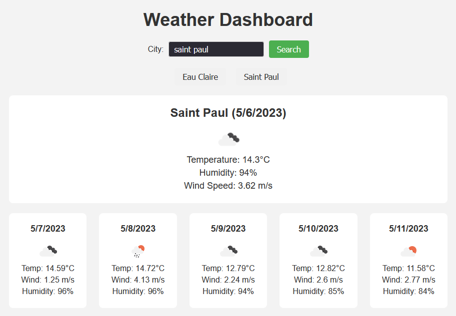

# Weather-Dashboard

## Description

Weather Dashboard is a web application that allows users to search for current weather conditions and a 5-day forecast for cities around the world. It provides an easy-to-use interface and stores search history for quick access to previously searched cities.

## Usage

1. Explore the deployed application at

2. Enter the city name in the search bar and click the "Search" button.

3. The current weather conditions for the searched city will be displayed, including city name, date, weather icon, temperature, humidity, and wind speed.

4. The 5-day forecast for the searched city will be displayed, including date, weather icon, temperature, humidity, and wind speed for each day.

5. The searched city will be added to the search history. Click on a city name in the search history to display its weather data again.

## License

N/A